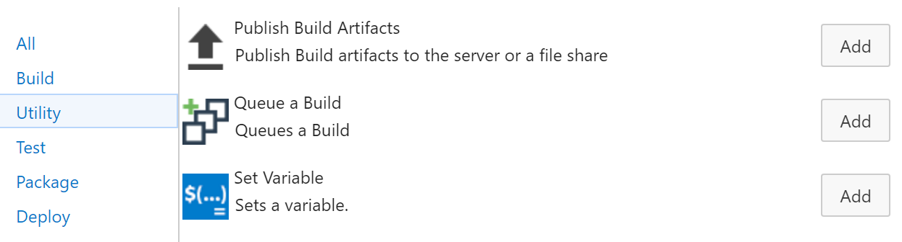

# Inception Build and Release Tasks

Visual Studio Team Services Build and Release Management extensions which brings the power of inception to your builds.

Learn more about this extension on the [wiki](https://github.com/geeklearningio/gl-vsts-tasks-inception/wiki)!

## Tasks included

* **[Queue a Build](https://github.com/geeklearningio/gl-vsts-tasks-inception/wiki/Queue-Build)**: Queues a build.

## Steps

After installing the extension, you can add one (or more) of the tasks to a new or existing [build definition](https://www.visualstudio.com/en-us/docs/build/define/create) or [release definition](https://www.visualstudio.com/en-us/docs/release/author-release-definition/more-release-definition)

## Learn more

The [source](https://github.com/geeklearningio/gl-vsts-tasks-inception) for this extension is on GitHub. Take, fork, and extend.